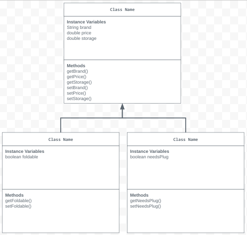

# Unit 2 - Store Management Project

## Introduction

I am opening a new business in my community! Businesses often need programs to manage the products and services they offer and track orders and requests from customers. My goal is to create a store management system for my business.

## Requirements

Use your knowledge of object-oriented programming and class structure and design to create your store management system:
- **Create a class hierarchy** – Develop a superclass that represents a product or service your business offers and one or more subclasses that extend the superclass to represent more specific types of products or services.
- **Declare instance variables** – Declare instance variables in the superclass that are shared with the subclasses and instance variables in the subclasses that are not shared with the superclass.
- **Write constructors** – Write no-argument and parameterized constructors in the superclass and subclasses. Subclass constructors use the super keyword to call the superclass constructor.
- **Implement accessor and mutator methods** – Write accessor and mutator methods for instance variables that should be accessible and/or modifiable from outside of the class.
- **Implement a toString() method** – Write toString() methods in the superclass and subclasses that return information about the state of an object.

## UML Diagram

## Description

The store that I created was a computer store. This store would sell different kinds of computers (the superclass), the types or subclasses listed were the laptop and desktop class. They all have different brands, storages, and prices. The laptop is foldable while the desktop is not foldable. I created this computer class because it was the first thing which came to mind when working in the computer science class. This project has different types of constructors, instance variables, and methods. The methods mainly consist of the get and set methods, while also including toString in order have everything pre formatted. Mine specifically also has the scanner class which means the user is able to input into the console.
